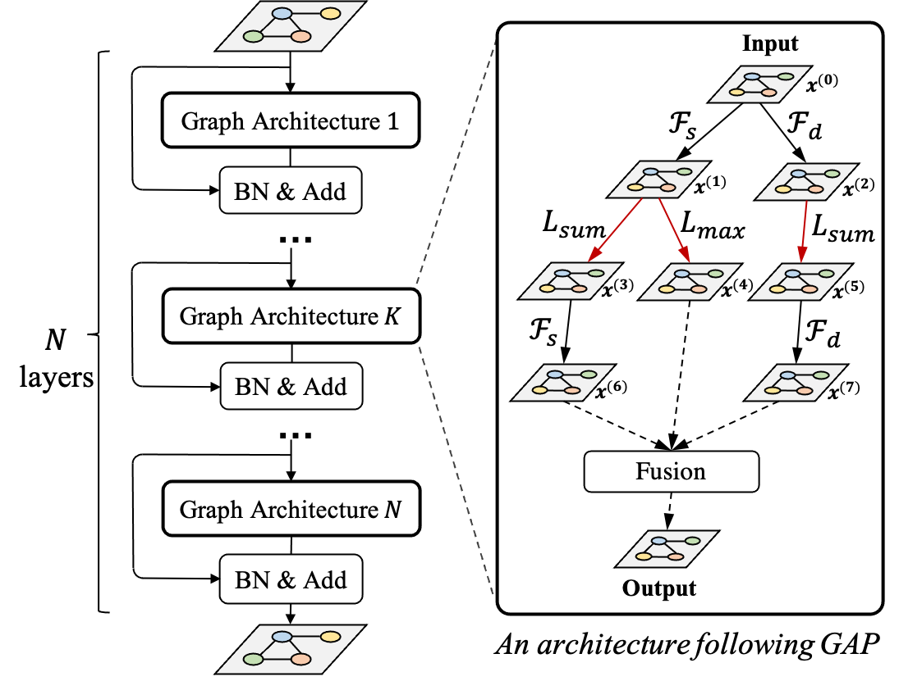
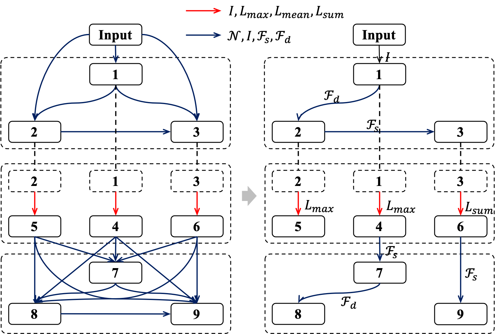
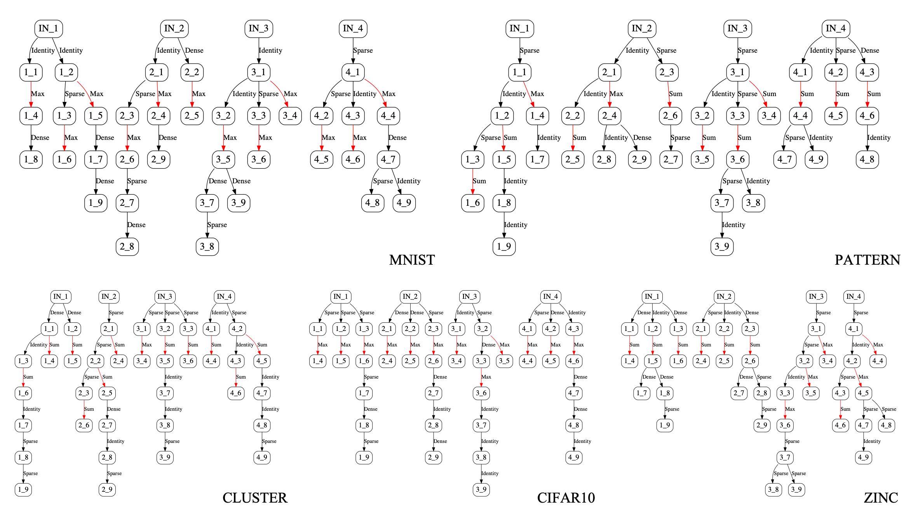

# Rethinking Graph Neural Architecture Search from Message-passing


<a href="https://arxiv.org/abs/2103.14282"></img></a> <a href="https://opensource.org/licenses/MIT"></img></a> 
## Intro

> The GNAS can automatically learn better architecture with the optimal depth of message passing on the graph. Specifically, we design Graph Neural Architecture Paradigm (GAP) with tree-topology computation procedure and two types of fine-grained atomic operations (feature filtering \& neighbor aggregation) from message-passing mechanism to construct powerful graph network search space. Feature filtering performs adaptive feature selection, and neighbor aggregation captures structural information and calculates neighbors’ statistics. Experiments show that our GNAS can search for better GNNs with multiple message-passing mechanisms and optimal message-passing depth. 

    


## Getting Started

### 0. Prerequisites
* Linux 
* NVIDIA GPU + CUDA CuDNN 

### 1. Setup Python environment for GPU

```sh
# clone Github repo
conda install git
git clone https://github.com/phython96/GNAS-MP.git
cd GNAS-MP

# Install python environment
conda env create -f environment_gpu.yml
conda activate gnas
```

### 2. Download datasets

The datasets are provided by project [benchmarking-gnns](https://github.com/graphdeeplearning/benchmarking-gnns), you can click [here](https://github.com/graphdeeplearning/benchmarking-gnns/blob/master/docs/02_download_datasets.md) to download all the required datasets. 

### 3. Searching
We have provided scripts for easily searching graph neural networks on five datasets. 

```sh
# searching on ZINC dataset at graph regression task
sh scripts/search_molecules_zinc.sh [gpu_id]

# searching on SBMs_PATTERN dataset at node classification task
sh scripts/search_sbms_pattern.sh [gpu_id]

# searching on SBMs_CLUSTER dataset at node classification task
sh scripts/search_sbms_cluster.sh [gpu_id]

# searching on MNIST dataset at graph classification task
sh scripts/search_superpixels_mnist.sh [gpu_id]

# searching on CIFAR10 dataset at graph classification task
sh scripts/search_superpixels_cifar10.sh [gpu_id]
```

When the search procedure is finished, you need to copy the searched genotypes from file "./save/[data_name]_search.txt" to "./configs/genotypes.py". 

For example, we have searched on MNIST dataset, and obtain genotypes result file "./save/MNIST_search.txt".
```python
Epoch : 19
[Genotype(alpha_cell=[('f_sparse', 1, 0), ('f_dense', 2, 1), ('f_sparse', 3, 2), ('a_max', 4, 1), ('a_max', 5, 2), ('a_max', 6, 3), ('f_sparse', 7, 6), ('f_identity', 8, 7), ('f_dense', 9, 7)], concat_node=None), Genotype(alpha_cell=[('f_sparse', 1, 0), ('f_dense', 2, 0), ('f_dense', 3, 0), ('a_max', 4, 1), ('a_max', 5, 2), ('a_max', 6, 3), ('f_identity', 7, 5), ('f_identity', 8, 6), ('f_sparse', 9, 8)], concat_node=None), Genotype(alpha_cell=[('f_sparse', 1, 0), ('f_sparse', 2, 0), ('f_sparse', 3, 0), ('a_max', 4, 1), ('a_max', 5, 2), ('a_max', 6, 3), ('f_sparse', 7, 4), ('f_sparse', 8, 6), ('f_identity', 9, 4)], concat_node=None), Genotype(alpha_cell=[('f_sparse', 1, 0), ('f_sparse', 2, 1), ('f_sparse', 3, 1), ('a_max', 4, 1), ('a_max', 5, 2), ('a_max', 6, 3), ('f_sparse', 7, 4), ('f_identity', 8, 7), ('f_sparse', 9, 4)], concat_node=None)]
Epoch : 20
[Genotype(alpha_cell=[('f_sparse', 1, 0), ('f_dense', 2, 1), ('f_sparse', 3, 2), ('a_max', 4, 1), ('a_max', 5, 2), ('a_max', 6, 3), ('f_sparse', 7, 6), ('f_identity', 8, 7), ('f_sparse', 9, 8)], concat_node=None), Genotype(alpha_cell=[('f_sparse', 1, 0), ('f_sparse', 2, 1), ('f_dense', 3, 0), ('a_max', 4, 1), ('a_max', 5, 2), ('a_max', 6, 3), ('f_identity', 7, 5), ('f_identity', 8, 6), ('f_sparse', 9, 8)], concat_node=None), Genotype(alpha_cell=[('f_sparse', 1, 0), ('f_sparse', 2, 0), ('f_sparse', 3, 0), ('a_max', 4, 1), ('a_max', 5, 2), ('a_max', 6, 3), ('f_sparse', 7, 4), ('f_dense', 8, 4), ('f_sparse', 9, 6)], concat_node=None), Genotype(alpha_cell=[('f_sparse', 1, 0), ('f_sparse', 2, 1), ('f_sparse', 3, 2), ('a_max', 4, 1), ('a_max', 5, 2), ('a_max', 6, 3), ('f_sparse', 7, 4), ('f_sparse', 8, 6), ('f_sparse', 9, 8)], concat_node=None)]
Epoch : 21
[Genotype(alpha_cell=[('f_sparse', 1, 0), ('f_dense', 2, 1), ('f_sparse', 3, 2), ('a_max', 4, 1), ('a_max', 5, 2), ('a_max', 6, 3), ('f_sparse', 7, 6), ('f_identity', 8, 7), ('f_sparse', 9, 8)], concat_node=None), Genotype(alpha_cell=[('f_sparse', 1, 0), ('f_dense', 2, 0), ('f_dense', 3, 0), ('a_max', 4, 1), ('a_max', 5, 2), ('a_max', 6, 3), ('f_identity', 7, 5), ('f_identity', 8, 6), ('f_identity', 9, 6)], concat_node=None), Genotype(alpha_cell=[('f_sparse', 1, 0), ('f_sparse', 2, 0), ('f_sparse', 3, 0), ('a_max', 4, 1), ('a_max', 5, 2), ('a_max', 6, 3), ('f_sparse', 7, 6), ('f_identity', 8, 4), ('f_identity', 9, 7)], concat_node=None), Genotype(alpha_cell=[('f_sparse', 1, 0), ('f_sparse', 2, 1), ('f_sparse', 3, 2), ('a_max', 4, 1), ('a_max', 5, 2), ('a_max', 6, 3), ('f_sparse', 7, 4), ('f_sparse', 8, 6), ('f_identity', 9, 4)], concat_node=None)]
```
Copy the fourth line from the above file and paste it into "./configs/genotypes.py" with the prefix "MNIST = ".
```python
MNIST_Net = [Genotype(alpha_cell=[('f_sparse', 1, 0), ('f_dense', 2, 1), ('f_sparse', 3, 2), ('a_max', 4, 1), ('a_max', 5, 2), ('a_max', 6, 3), ('f_sparse', 7, 6), ('f_identity', 8, 7), ('f_sparse', 9, 8)], concat_node=None), Genotype(alpha_cell=[('f_sparse', 1, 0), ('f_sparse', 2, 1), ('f_dense', 3, 0), ('a_max', 4, 1), ('a_max', 5, 2), ('a_max', 6, 3), ('f_identity', 7, 5), ('f_identity', 8, 6), ('f_sparse', 9, 8)], concat_node=None), Genotype(alpha_cell=[('f_sparse', 1, 0), ('f_sparse', 2, 0), ('f_sparse', 3, 0), ('a_max', 4, 1), ('a_max', 5, 2), ('a_max', 6, 3), ('f_sparse', 7, 4), ('f_dense', 8, 4), ('f_sparse', 9, 6)], concat_node=None), Genotype(alpha_cell=[('f_sparse', 1, 0), ('f_sparse', 2, 1), ('f_sparse', 3, 2), ('a_max', 4, 1), ('a_max', 5, 2), ('a_max', 6, 3), ('f_sparse', 7, 4), ('f_sparse', 8, 6), ('f_sparse', 9, 8)], concat_node=None)]
```

### 4. Training 
**Before training, you must confim that there is a genotype of searched graph neural network in file "./configs/genotypes.py".**

We provided scripts for easily training graph neural networks searched by GNAS.

```sh
# training on ZINC dataset at graph regression task
sh scripts/train_molecules_zinc.sh [gpu_id]

# training on SBMs_PATTERN dataset at node classification task
sh scripts/train_sbms_pattern.sh [gpu_id]

# training on SBMs_CLUSTER dataset at node classification task
sh scripts/train_sbms_cluster.sh [gpu_id]

# training on MNIST dataset at graph classification task
sh scripts/train_superpixels_mnist.sh [gpu_id]

# training on CIFAR10 dataset at graph classification task
sh scripts/train_superpixels_cifar10.sh [gpu_id]
```

---

## Results

### Visualization 
Here, we show 4-layer graph neural networks searched by GNAS on five datasets at three graph tasks.


## Reference

@inproceedings{cai2021rethinking,
  title={Rethinking Graph Neural Architecture Search from Message-passing},
  author={Cai, Shaofei and Li, Liang and Deng, Jincan and Zhang, Beichen and Zha, Zheng-Jun and Su, Li and Huang, Qingming},
  booktitle={Proceedings of the IEEE/CVF Conference on Computer Vision and Pattern Recognition},
  pages={6657--6666},
  year={2021}
}
